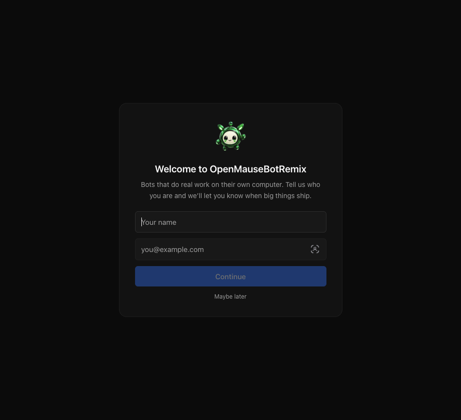
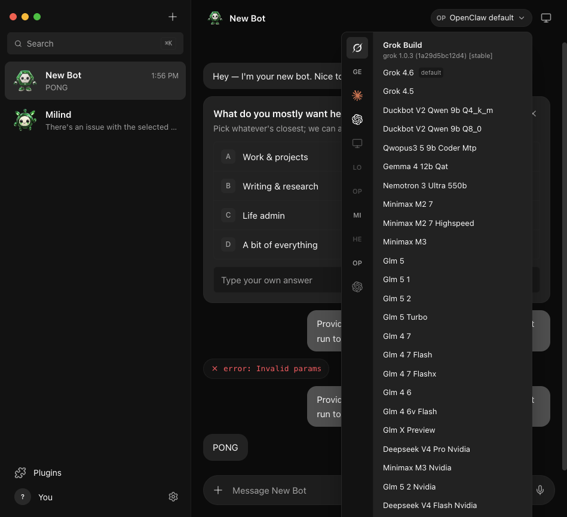
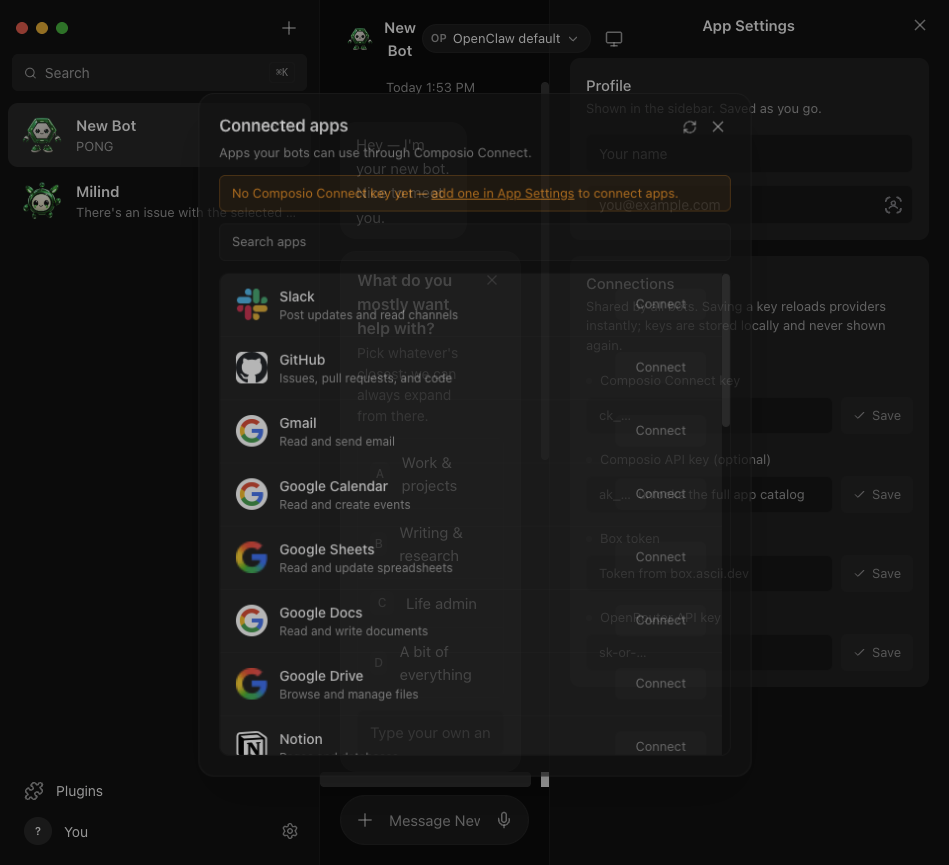
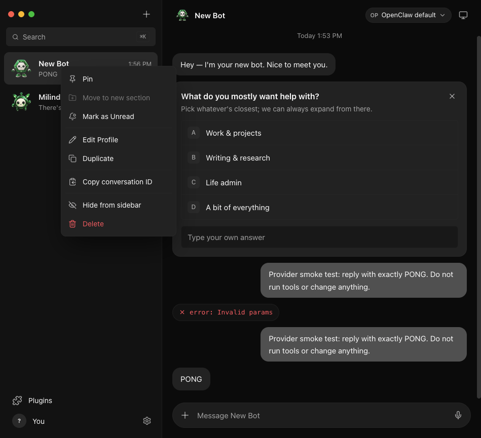
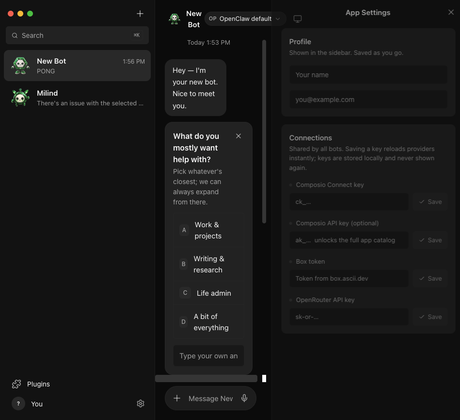
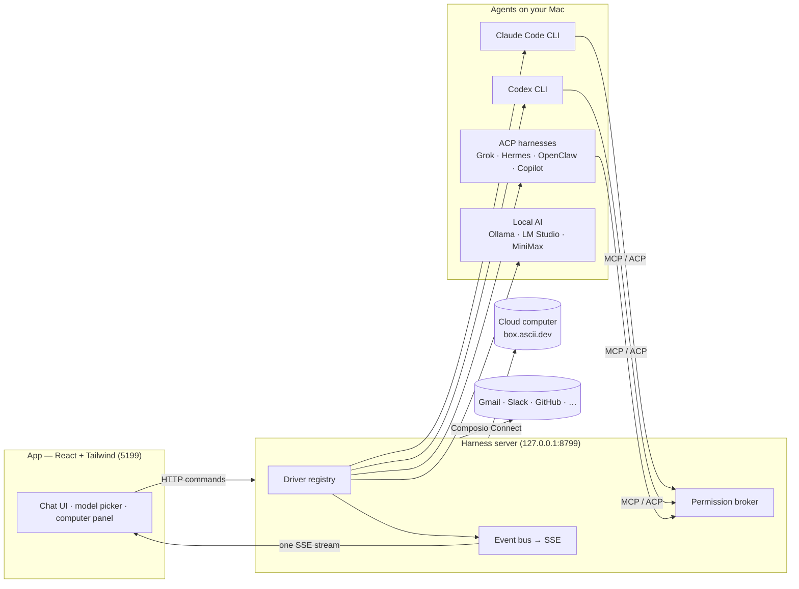

> ⚠️ **No affiliation with any cryptocurrency.** OpenMauseBotRemix has no token. Any coin using the OpenMauseBotRemix, Maus, or SupaMaus name is not created, endorsed, or affiliated with this project or its maintainer. I have received no tokens, payment, or allocation from anyone, and I will not be endorsing any token.

<div align="center">

# OpenMauseBotRemix

**Your own team of AI bots, in a chat app.**

<sub>OpenMauseBotRemix is an open-source version of **Grok Bot** — bring-your-own-agent, local-first, on the models and harnesses you already have.</sub>

Every bot in the sidebar is a real agent — Claude, Codex, Grok Build, Hermes, OpenClaw, Copilot, or a local/compatible model — with its own
personality, its own model, its own cloud computer, and its own connected apps.
Talk to them like contacts. Watch them work. Approve what matters.


<br>

<a href="https://github.com/milind-soni/openmausbot-releases/releases/latest/download/OpenMauseBotRemix.dmg">
  
</a>

<sub>Apple silicon · signed & notarized · one-click .dmg, always the latest · [all releases](https://github.com/milind-soni/openmausbot-releases/releases)</sub>

<br>
<br>



</div>

---

## Why

One assistant in one box is the wrong shape for agents. OpenMauseBotRemix is an open-source take on **Grok Bot** —
it keeps the idea (AI as a *messaging app*: a roster of bots you chat with, each with its own personality,
memory of its thread, model, computer, and apps) and rebuilds it open, local-first, and on the agents you
already have:

- **Bring your own agents.** Bots can run through Claude Code, Codex, Grok Build, Hermes ACP, OpenClaw ACP,
  GitHub Copilot ACP, MiniMax CLI, or any OpenAI-compatible local endpoint — your existing logins and
  subscriptions, no required proxy in the middle.
- **Local first.** One small harness server on `127.0.0.1` owns every agent process. Transcripts, keys, and
  events live in `~/.openmausbot`, not a cloud.
- **Agents with hands.** Each bot can get a real computer — a cloud Linux desktop it drives while you watch
  live, or your own Mac — plus 500+ apps through Composio Connect.
- **Local AI included.** Ollama, LM Studio, and other OpenAI-compatible `/v1` servers discover their models
  from `/models` and stream Chat Completions without leaving your machine.

## Features

<table>
<tr>
<td width="50%" valign="top">

### 🧠 Pick a brain per bot

A model picker with a provider rail — live catalogs, defaults marked, unavailable providers dimmed with the
reason, and exact model selection per bot. Grok Build reads the account-aware catalog from `grok models`,
including Grok, MiniMax, GLM, DeepSeek, Codex, and other models exposed by the installed harness.



</td>
<td width="50%" valign="top">

### 🖥️ Every bot gets a computer

Open the Computer panel and the bot's cloud desktop spins up on its own — live screen preview while it
works, "Open desktop" to take over in your browser, or point the bot at *this Mac* instead.


</td>
</tr>
<tr>
<td width="50%" valign="top">

### 🙋 Bots ask before they act

Shell commands, file edits, and questions surface as inline cards — Allow / Deny / answer in chat. A
permission broker turns every risky action into a decision you make, for cloud and local computers alike.


</td>
<td width="50%" valign="top">

### 🔌 Connected apps

A one-click marketplace over Composio Connect: Gmail, Slack, GitHub, Notion, Linear and hundreds more.
OAuth once, and every bot can use them as tools.



</td>
</tr>
<tr>
<td width="50%" valign="top">

### 🗂 Manage bots like chats

Right-click any bot: pin, mark unread, edit profile, duplicate, copy conversation ID, hide, delete. It's a
messaging app — your agents behave like contacts.



</td>
<td width="50%" valign="top">

### 🔑 Keys once, everything lights up

Paste credentials in App Settings — they persist locally and the provider fleet hot-reloads instantly.
Secrets are write-only: the UI only ever sees "configured" flags.



</td>
</tr>
</table>

**Also in the box:** streaming replies with tool-run activity chips · native macOS dictation from the
composer mic (on-device Apple speech recognition — desktop app) · SupaMaus cursor mascots with role-aware
expressions · high-quality raster Orb, Rounded Square, Diamond, and Hexagon mascot shapes · searchable bot
sidebar with Cmd/Ctrl-K focus · screenshots of the bot's work folded into the transcript.

## How it works

Two processes. The app holds no transports of its own — it sends typed commands over HTTP and folds one SSE
event stream into state. The harness server owns every agent process and normalizes each provider's native
protocol into one canonical runtime event stream (logged per-thread as NDJSON).



| Layer | Where | What it does |
|---|---|---|
| Drivers | `server/drivers/` | One per provider: Claude, Codex, Grok Build, Gemini, Hermes, OpenClaw, Copilot, MiniMax, local AI, OpenRouter, and cloud-computer agents. Unknown drivers degrade to "unavailable", never crash the fleet. |
| Harness | `server/harness/` | Registry (configs → live instances) and the fan-in event bus every client folds. |
| API | `server/index.ts` | Bots, turns, approvals, model catalog, computer lifecycle, connectors, config — HTTP + SSE. |
| App | `src/` | The chat shell. Server-backed store, one reducer, zero client-side transports. |
| Desktop | `electron/` | macOS shell: dictation helper (SFSpeechRecognizer), local screen capture, CUA bridge. |

## Quick start

**Easiest:** [download the latest .dmg](https://github.com/milind-soni/openmausbot-releases/releases/latest),
drag it to Applications, open it. The harness server is embedded — no setup.

**From source:**

```sh
git clone https://github.com/Franzferdinan51/OpenMausBotRemix && cd OpenMausBotRemix
pnpm install

pnpm dev:server    # harness server → 127.0.0.1:8799
pnpm dev           # app → http://127.0.0.1:5199
pnpm dev:desktop   # or the Electron shell
```

Requirements: **macOS**, **Node 24+**, and **pnpm**. Add at least one harness for the experience you want:

| Harness/provider | Setup | What it enables |
|---|---|---|
| Claude Code | Install [`claude`](https://claude.com/claude-code) and log in | Claude Agent SDK-style local agent turns |
| Codex | Install [`codex`](https://github.com/openai/codex) and log in | Codex app-server turns and approvals |
| Grok Build | Install [`grok`](https://x.ai/cli) and log in | ACP agent plus the live `grok models` catalog |
| Hermes | Install `hermes-acp` and authenticate | Hermes ACP relay |
| OpenClaw | Install/configure OpenClaw Gateway | OpenClaw ACP turns and local gateway access |
| GitHub Copilot | Install `copilot --acp --stdio` and log in | Copilot ACP turns |
| MiniMax | Install `mmx` and run `mmx auth login` | MiniMax M3/M2.7 CLI access |
| Local AI | Run Ollama, LM Studio, or another `/v1` server | Local model discovery and streaming |

Configured CLIs appear in the model picker automatically; unavailable entries remain visible with their
diagnostic reason.

Optional, pasted once in **App Settings** (gear in the sidebar footer):

| Key | Unlocks |
|---|---|
| Composio Connect key (`ck_…`) | The connected-apps marketplace |
| Composio API key (`ak_…`) | The full 500+ app catalog with official logos |
| Box token ([box.ascii.dev](https://box.ascii.dev)) | Cloud computers for your bots |

Composio uses two different credentials: the **Connect key** (`ck_…`) is for the Connect MCP server and
connected-app authorization; the **project API key** (`ak_…`) is for the full REST toolkit catalog and logos.
If a connector request returns HTTP 500, check that the credential is in the matching field, that it belongs
to the intended Composio project, and inspect the server log for the upstream request message.

```sh
pnpm typecheck     # app + server
pnpm build         # typecheck + production build
pnpm test          # Vitest unit/API/provider regression suite
```

## Status

The core loop works end to end: message → agent → streamed reply → tools → approvals → computer use.
The app also includes live provider health, model catalogs, local AI connections, provider-specific ACP
harnesses, persisted bot/model repair on startup, Composio connected apps, and raster mascot customization.
Routines (scheduled tasks) remain a placeholder, sidebar sections aren't built yet, and Windows/Linux shells
haven't been attempted (the harness itself is portable Node).

Contributions welcome — the driver SPI in [`server/contracts.ts`](server/contracts.ts) is deliberately
small; adding a provider is one file in [`server/drivers/`](server/drivers/) plus a one-line registration.

## License

[MIT](LICENSE) © 2026 Milind Soni and contributors.

OpenMauseBotRemix is an independent, open-source project inspired by Grok Bot. It is
not affiliated with, endorsed by, or associated with xAI; "Grok" is a trademark
of its respective owner.
